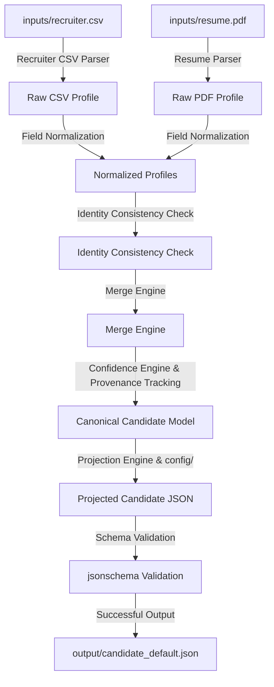

# Candidate Data Transformer

A deterministic Candidate Data Transformation Pipeline that merges unstructured Resume PDF data and optional structured Recruiter CSV inputs into a single, unified canonical profile. It features field-level conflict resolution, custom configuration-driven runtime schema projection, validation, data provenance tracking, and deterministic confidence scoring.

The pipeline is fully explainable, deterministic, and configuration-driven, visualized via an interactive, lightweight Streamlit Dashboard.

---

## Architecture Overview



The pipeline operates across several stages:
1. **Resume Parser**: Extracts structured information from the resume PDF.
2. **Recruiter CSV Parser**: Reads recruiter-supplied candidate metadata records.
3. **Field Normalization**: Standardizes individual fields before merge calculations.
4. **Identity Consistency Check**: Compares emails, phone numbers, and names using fuzzy similarity heuristics to ensure records belong to the same candidate.
5. **Merge Engine**: Merges fields using deterministic source priority rules.
6. **Confidence Engine**: Dynamically calculates reliability scores based on source trust, field completeness, and merge agreement.
7. **Provenance Tracking**: Logs every field value's origin (source files and extraction methods).
8. **Projection Engine**: Maps and re-shapes fields at runtime based on configuration schemas.
9. **Schema Validation**: Generates custom JSON Schema matching runtime configurations and validates output payloads.
10. **Streamlit Dashboard**: Inspection and visualization interface for normalized candidate data.

---

## Assignment Coverage

✔ **Resume PDF Parsing**: High-fidelity text extraction using pdfplumber.

✔ **Recruiter CSV Parsing**: Processes recruiter candidate notes safely using pandas.

✔ **Resume-only execution**: Handles execution when only the resume PDF is provided.

✔ **CSV-only execution**: Handles execution when only the recruiter CSV is provided.

✔ **Multi-source merge**: Merges fields based on deterministic priority policies.

✔ **Canonical normalization**: Standardizes names, emails, phones, skills, locations, education, experience, and links.

✔ **Config-driven projection**: Remaps, renames, and filters fields at runtime.

✔ **Provenance tracking**: Logs source and method audit logs for all fields.

✔ **Deterministic confidence scoring**: Computes reliability metrics without statistical prediction.

✔ **Schema validation**: Dynamically builds and runs validator checks.

✔ **Streamlit visualization**: Provides interactive candidate profile tabs.

✔ **Typer CLI**: Standard CLI pipeline execution.

---

## Engineering Design Principles

The implementation follows four engineering principles:

• **Deterministic execution**: All pipeline components are reproducible and rule-based.

• **Explainable transformations**: Calculations and normalizations are fully explainable.

• **Config-driven output projection**: Dynamic schemas and output formats are configured at runtime.

• **End-to-end traceability using provenance**: Field origins are preserved throughout the lifecycle.

---

## Folder Structure

```
eightfold-transformer/
├── config/
│   ├── default_config.json      # Mapping config for all canonical fields
│   └── custom_config.json       # Remapped layout omitting education & provenance
├── inputs/
│   ├── recruiter.csv            # Mock recruiter candidate profile input
│   └── resume.pdf               # Mock candidate resume PDF input
├── output/
│   ├── candidate_default.json   # Output from default configuration
│   └── candidate_custom.json    # Output from custom configuration
├── models/
│   ├── canonical.py             # Pydantic schema models for the profile
├── parsers/
│   ├── csv_parser.py            # Recruiter CSV Parser
│   └── resume_parser.py         # Resume Parser
├── normalizers/
│   ├── phone.py                 # E.164 phone formatting
│   ├── email.py                 # Clean/lowercase email parser
│   ├── dates.py                 # YYYY-MM date normalizer
│   ├── skills.py                # rapidfuzz skills matcher
│   └── location.py              # ISO-3166 alpha-2 location standardizer
├── merge/
│   ├── merge_engine.py          # Deterministic merger
│   ├── confidence.py            # Confidence Calculator
│   └── provenance.py            # Origin tracking models
├── projection/
│   └── projector.py             # Schema remapper and missing values handler
├── validator/
│   └── schema_validator.py      # Dynamic JSON Schema builder and validator
├── tests/
│   ├── test_pipeline.py         # Automated pipeline execution tests
│   └── test_conflict.py         # Conflict merge scoring tests
├── ui/
│   └── streamlit_app.py         # Streamlit Dashboard
├── app.py                       # Main application entrypoint (CLI & Streamlit router)
├── LICENSE                      # MIT license file
├── requirements.txt             # Project library dependencies
├── .gitignore                   # Git exclusion rules
├── ARCHITECTURE.md              # Technical pipeline diagrams
├── DESIGN.md                    # Ingestion strategy and methodology
├── technical_design.md          # Technical design notes
├── technical_abstract.md        # Technical abstract markdown source
├── docs/
│   ├── Technical_Abstract.pdf   # Print-ready one-page technical abstract PDF
│   └── Technical_Design.pdf     # Print-ready technical design document PDF
└── tools/
    └── generate_pdf.py          # Documentation PDF compilation script
```

---

## Installation & Setup

Ensure Python 3.11+ is installed.

```bash
# Clone the repository
git clone https://github.com/your-org/eightfold-transformer.git
cd eightfold-transformer

# Install dependencies
pip install -r requirements.txt
```

---

## Run Instructions

### Command Line Interface (CLI)
Run the pipeline using `app.py`:

#### 1. Default Configuration
```bash
python app.py \
    --csv inputs/recruiter.csv \
    --resume inputs/resume.pdf \
    --config config/default_config.json \
    --output output/candidate_default.json
```

#### 2. Custom Configuration
```bash
python app.py \
    --csv inputs/recruiter.csv \
    --resume inputs/resume.pdf \
    --config config/custom_config.json \
    --output output/candidate_custom.json
```

### Streamlit Dashboard
Launch the web interface for manual file uploads and visual inspection:

```bash
streamlit run app.py
```

---

## Streamlit Dashboard Layout

The Streamlit Dashboard is structured into an engineering-focused layout:
- **Left Sidebar**:
  - File upload slots for Resume PDF and Recruiter CSV (Optional).
  - Configuration selector template dropdown.
  - Quick action run buttons.
- **Main Panel Tabs**:
  - **Overview**: High-level candidate stats, identity records, and top skills.
  - **Professional Experience**: Formatted timeline list cleaning extraction artifacts.
  - **Education Records**: Standardized degree records and grades.
  - **Skills**: Deduplicated, canonical tags.
  - **Raw JSON**: Interrogatable dictionary payload.
  - **Confidence**: Dynamic progress bars representing field-level confidence scores.
  - **Provenance**: Tabular audit trail showing the source and method for all fields.
  - **Pipeline Info**: Pipeline performance statistics and metadata metrics.

---

## Sample Output (Custom Config)
```json
{
  "candidate_name": "Umar Mohmed",
  "primary_email": "umarmd0507@gmail.com",
  "primary_phone": "+919392466218",
  "skills_list": [
    "Python",
    "Java",
    "SQL",
    "Machine Learning",
    "Deep Learning",
    "PyTorch"
  ],
  "country_code": "IN",
  "_confidence": {
    "candidate_name": 0.95,
    "primary_email": 0.95,
    "primary_phone": 0.95,
    "skills_list": 0.902,
    "country_code": 0.6
  },
  "_overall_confidence": 0.852
}
```

---

## Testing
Validate the entire pipeline using `pytest`:

```bash
python -m pytest tests/
```

---

## Future Improvements
- **Additional ATS Formats**: Support standard XML, docx, or HTML uploads.
- **OCR Support**: Incorporate optical character recognition engines for scanned resume images.
- **Batch Processing**: Run multi-profile matches over complete folders using the CLI.
- **REST API**: Wrap the pipeline as a FastAPI service for enterprise ATS integrations.
- **Enhanced Identity Matching**: Incorporate multi-factor identity matching heuristics.

---

## Assignment Deliverables

The repository delivers all requirements specified by the internship task:
1. **Multi-Source Parsing & Normalization**: Layout-aware Resume PDF parser and pandas-based Recruiter CSV parser with strict E.164 phone formats, lowercase emails, and fuzzy skills matching.
2. **Deterministic Merge Engine**: Priority override strategies, identity validation checkpoints, dynamic completeness confidence scoring, and field-level provenance tracking.
3. **Config-Driven Projection & Validation**: Dynamic output remapping and verification using dynamic JSON schema compilers (Draft-07 standard).
4. **Interactive Dashboard & CLI**: Full Typer command-line interface and modular Streamlit UI showing metrics progress tabs and raw data tabs.

---

## Documentation Links

*   **Project Abstract**:
    *   [Technical Abstract PDF](file:///c:/Users/ASUS/OneDrive/Desktop/eightfold-transformer/docs/Technical_Abstract.pdf)
    *   [Technical Abstract Markdown](file:///c:/Users/ASUS/OneDrive/Desktop/eightfold-transformer/technical_abstract.md)
*   **Technical Design & Architecture**:
    *   [Technical Design PDF](file:///c:/Users/ASUS/OneDrive/Desktop/eightfold-transformer/docs/Technical_Design.pdf)
    *   [Technical Design Markdown](file:///c:/Users/ASUS/OneDrive/Desktop/eightfold-transformer/technical_design.md)
    *   [Architecture Diagram](file:///c:/Users/ASUS/OneDrive/Desktop/eightfold-transformer/ARCHITECTURE.md)
    *   [Design Methodology Strategy](file:///c:/Users/ASUS/OneDrive/Desktop/eightfold-transformer/DESIGN.md)
